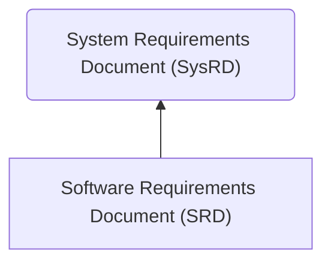

## Overview

This folder contains the requirement documents for the flight computer. There are two such documents:

### 1. System Requirements Document

This document describes the high level behavior of the system. Each requirement describes an entire feature or a critical detail of how the system should behave. These requirements are verified via system or integration tests.

### 2. Software Requirements Document

This document describes the low-level behavior of the application. Each requirement describes a detail for a feature's behavior. These requirements are verified via unit tests or integration tests.

### 3. Relationship

The two documents coexist to complement each other. In general, the SRD exists to provide specific detail when it would be impractical to verify that detail at the system testing level. Since each SRD requirement describes a detail for how a feature should behave, each SRD requirement is expected to trace to a SysRD requirement. If a requirement does not map directly to something that is specified at the system testing level, it is expected to have a rationale as to why the requirement is necessary.

